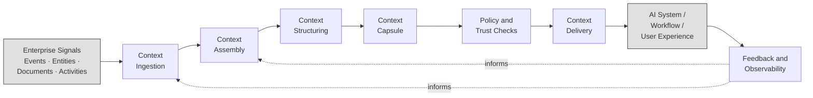
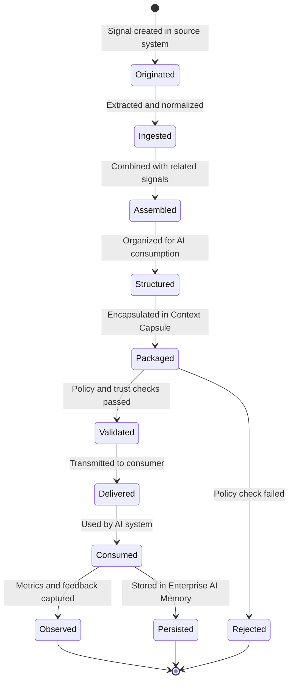

# Context Capsule Lifecycle

*From enterprise signals to AI consumption and observability*

This document describes the lifecycle stages of a Context Capsule within an Enterprise Context Fabric architecture. It traces the journey of enterprise information from its origin as raw signals through ingestion, assembly, structuring, governance, delivery, and consumption.

This is a conceptual lifecycle model. Implementations may adapt stages, ordering, and boundaries based on specific requirements.

---

## Lifecycle Overview

A Context Capsule passes through the following stages during its lifecycle:

1. **Enterprise Signals** — Raw data originates in enterprise systems
2. **Context Ingestion** — Signals are extracted, normalized, and classified
3. **Context Assembly** — Signals from multiple sources are combined into context objects
4. **Context Structuring** — Assembled context is organized into structured forms
5. **Context Capsule** — Structured context is packaged into a self-contained capsule
6. **Policy and Trust Checks** — Governance rules are validated before delivery
7. **Context Delivery** — The capsule is transmitted to the requesting AI system
8. **AI System / Workflow** — The consumer uses the context for reasoning and action
9. **Feedback and Observability** — Delivery metrics and usage signals are captured

---

## Lifecycle Diagram

---

## Stage Details

### 1. Enterprise Signals

Enterprise signals are the raw data elements generated by business operations across organizational systems. These signals represent the ground truth of what is happening within the enterprise.

**Signal types may include**:
- **Events** — Activities that occur at a specific point in time (ticket created, message sent, commit pushed, meeting scheduled)
- **Entities** — Persistent objects that represent organizational concepts (customers, accounts, projects, incidents, team members)
- **Documents** — Unstructured or semi-structured content (knowledge base articles, meeting notes, design documents, runbooks)
- **Activities** — Ongoing or recurring processes (sprint progress, pipeline status, engagement sequences)

Signals originate in systems such as CRM platforms, collaboration tools, ticketing systems, code repositories, documentation platforms, and operational databases.

At this stage, signals exist in their native formats within their respective source systems. The context engineering stack does not own these systems — it connects to them.

---

### 2. Context Ingestion

The ingestion stage extracts signals from enterprise source systems and prepares them for assembly. Ingestion transforms source-specific data into normalized signals that downstream layers can process uniformly.

**Activities at this stage may include**:
- Establishing authenticated connections to source system APIs, webhooks, or data feeds
- Extracting relevant signals based on defined extraction rules
- Normalizing source-specific formats into a standardized signal representation
- Enriching signals with metadata: timestamps, source identifiers, entity references, and classification tags
- Classifying signals by sensitivity and compliance requirements at the ingestion boundary

**Ingestion patterns**:
- **Real-time** — Signals captured as events occur through webhooks or streaming APIs
- **Scheduled** — Signals extracted on defined intervals for batch processing
- **On-demand** — Signals retrieved in response to a specific assembly request

Governance begins at ingestion. Credentials are managed securely, signals are classified on entry, and compliance filters prevent unauthorized or regulated data from entering the pipeline without appropriate controls.

---

### 3. Context Assembly

The assembly stage combines normalized signals from multiple source systems into coherent context objects. Assembly follows pre-defined patterns that specify what signals to gather, how to combine them, and what governance rules to apply.

**Activities at this stage may include**:
- Executing assembly patterns based on the task type and context request
- Connecting signals across system boundaries (linking the same customer entity from CRM and ticketing, relating a code commit to a project issue)
- Applying temporal ordering to establish event sequences
- Retrieving previously assembled context from Enterprise AI Memory when appropriate
- Persisting newly assembled context for future retrieval

**Assembly characteristics**:
- **Deterministic** — Given the same inputs and pattern, assembly produces equivalent results
- **Traceable** — Every element in the assembled context can be traced to its source signal
- **Governed** — Access controls and compliance rules are applied during assembly

Assembly is the core stage where cross-system context fusion occurs. It transforms isolated signals into connected, meaningful context.

---

### 4. Context Structuring

The structuring stage organizes assembled context into formats optimized for AI consumption. It bridges the gap between raw assembled signals and the structured, annotated context that enables effective AI reasoning.

**Activities at this stage may include**:
- Applying structural schemas to organize context consistently
- Arranging context around primary entities (customer, project, incident)
- Ordering events chronologically to preserve temporal relationships
- Adapting context structure for the specific task type
- Filtering redundant or low-value signals to reduce noise

Structuring ensures that AI systems receive context in a form that supports efficient parsing and reasoning, rather than requiring the model to organize raw information itself.

---

### 5. Context Capsule

At this stage, structured context is packaged into a self-contained Context Capsule. The capsule encapsulates all the information an AI system needs for a specific task, along with metadata and governance information.

**A capsule typically includes**:
- **Entities** — Structured representations of people, accounts, projects, and other organizational objects
- **Relationships** — Connections between entities
- **Events** — Time-stamped records of activities and changes
- **Metadata** — Capsule identifier, creation timestamp, assembly pattern reference, freshness window
- **Provenance** — Source systems, signal count, assembly duration
- **Policy context** — Access level, data classification, compliance tags

See the [Conceptual Context Capsule Schema](../specs/conceptual-context-capsule-schema-v0.1.md) for an illustrative schema and example.

---

### 6. Policy and Trust Checks

Before a capsule is delivered, governance rules are validated to ensure the context meets policy requirements. Trust checks enforce the principle that trust boundaries must be explicit.

**Checks at this stage may include**:
- **Access control validation** — Verifying that the requesting user or system is authorized to receive this context
- **Data classification enforcement** — Ensuring that the capsule's classification level is appropriate for the consumer
- **Field-level masking** — Redacting or masking sensitive fields that the consumer is not authorized to see
- **Compliance verification** — Confirming that delivery complies with applicable regulatory requirements (data residency, consent, retention)
- **Freshness validation** — Confirming that the capsule is within its freshness window and has not expired

Capsules that fail trust checks are not delivered. The system may return a reduced-scope capsule, a governance error, or trigger re-assembly with adjusted parameters.

---

### 7. Context Delivery

The delivery stage transmits the validated capsule to the requesting AI system or workflow. Delivery adapts the capsule format to the consumer's requirements and logs the transaction for audit.

**Delivery mechanisms may include**:
- **Synchronous API** — Request-response delivery for interactive AI systems
- **Asynchronous push** — Event-driven delivery for background workflows
- **Streaming** — Continuous delivery for real-time context updates
- **Cached delivery** — Serving pre-assembled capsules within freshness windows

**Delivery responsibilities**:
- Format adaptation for the consuming system
- Compression and optimization for delivery performance
- Audit logging of every delivery transaction
- Time-to-Context measurement (elapsed time from request to delivery)

---

### 8. AI System / Workflow

The AI system or workflow receives the Context Capsule and uses its contents for reasoning, decision making, or action. This is where context becomes operational.

**Consumers may include**:
- **AI copilots** — Assistants embedded in enterprise tools that use context to generate relevant suggestions
- **Autonomous agents** — AI systems that perform multi-step tasks using delivered context
- **Decision-support tools** — Interfaces that present context-enriched analysis to human decision makers
- **Automation workflows** — Processes that use context for routing, escalation, or notification decisions

The consumer is responsible for using the context appropriately. The fabric ensures the right context reaches the right consumer with the right governance applied.

---

### 9. Feedback and Observability

The final stage captures metrics, signals, and feedback about the context delivery process. Observability enables continuous improvement of context infrastructure.

**Feedback signals may include**:
- **Time-to-Context measurements** — How long each stage of the lifecycle took
- **Signal coverage metrics** — What percentage of requested signals were successfully retrieved
- **Assembly completeness** — Whether the assembly pattern was fully satisfied
- **Delivery success rates** — Whether capsules were delivered successfully
- **Consumer feedback** — Signals about whether the delivered context was useful and complete

Observability data feeds back into the ingestion and assembly stages, informing optimization of extraction rules, assembly patterns, and delivery configuration.

---

## Lifecycle State Transitions

---

## Lifecycle Characteristics

| Characteristic | Description |
|---|---|
| **Deterministic** | Assembly produces equivalent results given the same inputs and pattern |
| **Governed** | Trust and policy checks are embedded throughout the lifecycle, not applied only at delivery |
| **Observable** | Every stage emits metrics and audit events |
| **Traceable** | Every element in a delivered capsule can be traced to its source signal and assembly pattern |
| **Temporal** | The lifecycle preserves temporal ordering and freshness metadata |
| **Persistent** | Assembled context may be stored in Enterprise AI Memory for future retrieval |

---

## Relationship to Time-to-Context

Time-to-Context measures the total elapsed time across lifecycle stages 2 through 7 (from ingestion through delivery). Each stage contributes latency:

- **Ingestion latency** — Time to extract and normalize signals from source systems
- **Assembly latency** — Time to execute the assembly pattern and combine signals
- **Structuring latency** — Time to organize context into the required format
- **Governance latency** — Time to validate policy and trust checks
- **Delivery latency** — Time to transmit the capsule to the consumer

Optimizing Time-to-Context requires attention to each stage. Pre-assembly, caching, and parallel ingestion are examples of techniques that implementations may use to reduce overall lifecycle duration.

See the [Time-to-Context Metric Framework](../specs/time-to-context-metric-framework-v0.1.md) for the detailed measurement framework.

---

## Related Documents

- [Conceptual Context Capsule Schema](../specs/conceptual-context-capsule-schema-v0.1.md) — Illustrative schema for Context Capsules
- [Canonical Architecture](context-engineering-canonical-architecture.md) — Six-layer canonical architecture
- [Architecture Overview](architecture-overview.md) — Layered architecture overview
- [Context Engineering Principles](../principles/context-engineering-principles.md) — Design principles for context infrastructure
- [Context Engineering Stack Diagram](context-engineering-stack-diagram.md) — Visual stack diagram
- [Time-to-Context Metric Framework](../specs/time-to-context-metric-framework-v0.1.md) — Measurement framework for context delivery performance
