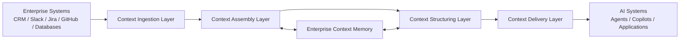

# Context Engineering Reference Architecture Diagram

This document provides the canonical visual representation of Enterprise Context Fabric architecture.

---

## Architecture Diagram

---

## Component Descriptions

### Context Sources

Enterprise systems that contain signals such as entities, events, documents, and relationships. These are the originating systems from which context is drawn.

**Examples**:
- **CRM systems** — Customer records, account data, opportunity tracking, relationship history
- **Collaboration platforms** — Messages, conversations, threads, meeting notes, shared channels
- **Ticketing systems** — Support tickets, incidents, change requests, service catalog entries
- **Code repositories** — Commits, pull requests, code reviews, build results, documentation
- **Operational databases** — Business-specific structured data, transactional records, reference data

Context sources are external to the fabric. The fabric connects to them through the ingestion layer.

---

### Context Ingestion Layer

Responsible for collecting signals and events from enterprise systems.

The ingestion layer establishes connections to source systems, extracts relevant signals, and normalizes them into a standardized format. It supports multiple ingestion patterns — real-time via webhooks, scheduled via polling, and on-demand via direct queries.

Governance begins at ingestion: credentials are managed securely, signals are classified on entry, and compliance filters prevent unauthorized data from entering the pipeline.

---

### Context Assembly Layer

Responsible for connecting relationships and signals across systems.

The assembly layer takes normalized signals from multiple sources and combines them into coherent context objects. It executes pre-defined assembly patterns that specify what signals to gather, from which sources, and under what governance rules.

Assembly is deterministic — given the same inputs and pattern, it produces equivalent outputs. This ensures traceability and repeatability across interactions.

---

### Context Structuring Layer

Responsible for organizing context into structured forms suitable for AI systems.

The structuring layer transforms assembled context into formats that AI consumers can parse efficiently. It applies schemas, organizes context around primary entities, preserves temporal relationships, and adapts structure to the specific task type.

Structuring bridges the gap between raw assembled signals and the organized, annotated context that enables effective AI reasoning.

---

### Context Delivery Layer

Responsible for delivering relevant context to AI systems and workflows.

The delivery layer packages structured context into Context Capsules — self-contained units with metadata, governance tags, and freshness indicators. It adapts delivery format to consumer requirements, enforces access controls at the delivery boundary, and logs all deliveries for audit.

Delivery modes include synchronous (request-response), asynchronous (push), streaming (continuous), and cached (pre-assembled).

---

### Enterprise Context Memory

Maintains continuity of knowledge across time and interactions.

Enterprise Context Memory provides the persistence layer within the architecture. It stores assembled context, entity relationships, and event history, making them available for future assembly and delivery operations. This enables AI systems to benefit from accumulated organizational knowledge rather than starting from scratch with each interaction.

Memory is bidirectionally connected to both the assembly and structuring layers, allowing patterns to retrieve historical context and persist newly assembled context.

---

### AI Systems and Applications

Consumers of structured context delivered by the fabric.

**Examples include**:
- **AI copilots** — Assistants embedded in enterprise workflows that use context to provide relevant suggestions
- **Workflow automation** — Systems that use assembled context to execute or recommend actions
- **Decision-support systems** — Tools that present context-enriched analysis to human decision makers
- **Autonomous agents** — AI systems that perform multi-step tasks using delivered context for grounding

AI consumers receive context through standardized delivery interfaces and do not need to understand the underlying source systems or assembly process.
