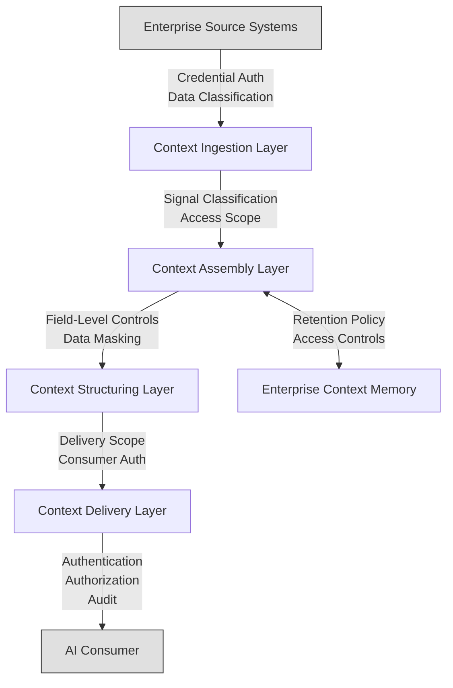

# Context Governance Model

*Governance checkpoints across the context engineering lifecycle*

Governance is a cross-cutting concern in Enterprise Context Fabric architecture. Rather than applying governance as an afterthought at the point of delivery, context engineering systems embed governance into every stage of the context lifecycle.

This document describes the conceptual governance model for context engineering systems. It defines governance checkpoints, trust boundaries, and policy enforcement mechanisms at each layer of the architecture.

This is a conceptual reference model. Implementations may adapt governance mechanisms based on organizational requirements, regulatory environments, and deployment contexts.

---

## Governance Principles

Context governance is guided by the following principles:

- **Governance by design** — Access controls and compliance requirements are embedded into the architecture, not bolted on after deployment
- **Trust boundaries must be explicit** — Every transition between layers, systems, or consumers represents a trust boundary that must be explicitly defined and enforced
- **Least privilege** — Context is delivered with the minimum scope required for the task at hand
- **Auditability** — Every context operation is logged and traceable, from ingestion through delivery
- **Classification at origin** — Signals are classified by sensitivity at the point of ingestion, and classification is preserved throughout the lifecycle

---

## Governance Checkpoints by Layer

### Context Ingestion Governance

Governance at the ingestion layer controls what signals enter the context engineering pipeline and how they are classified.

**Checkpoints may include**:

- **Credential management** — Secure storage and rotation of authentication credentials for source system connections
- **Data classification** — Classifying ingested signals by sensitivity level (public, internal, confidential, restricted) at the ingestion boundary
- **Consent verification** — Confirming that signals derived from personal communications or interactions have appropriate consent
- **Compliance filtering** — Preventing regulated data from entering the pipeline without appropriate controls (GDPR, HIPAA, SOC 2)
- **Source validation** — Verifying that signals originate from authenticated, authorized source systems

**Trust boundary**: Between enterprise source systems and the ingestion layer. Credentials, authentication, and data classification are enforced at this boundary.

---

### Context Assembly Governance

Governance at the assembly layer controls how signals are combined and what context objects are produced.

**Checkpoints may include**:

- **Access scope enforcement** — Ensuring that assembly patterns only combine signals the requesting consumer is authorized to access
- **Cross-system authorization** — Validating that the consumer has appropriate access rights across all source systems contributing to the assembled context
- **Pattern authorization** — Verifying that the requesting entity is authorized to execute the specified assembly pattern
- **Sensitivity propagation** — Ensuring that the assembled context inherits the highest sensitivity classification of any contributing signal
- **Assembly audit logging** — Recording what signals were combined, which pattern was executed, and what governance rules were applied

**Trust boundary**: Between the ingestion layer and the assembly layer. Signal classification and access scope are enforced at this boundary.

---

### Context Structuring Governance

Governance at the structuring layer controls how assembled context is organized and what information is included in the final structured output.

**Checkpoints may include**:

- **Field-level access control** — Enforcing field-level permissions to ensure that specific attributes are only visible to authorized consumers
- **Data masking** — Redacting or masking sensitive fields (personal identifiers, financial data, credentials) before structuring for delivery
- **Retention policy application** — Applying data retention rules to determine which historical context elements may be included
- **Noise filtering with governance awareness** — Ensuring that filtering and deduplication do not inadvertently expose or suppress governed information

**Trust boundary**: Between the assembly layer and the structuring layer. Field-level access controls and masking rules are enforced at this boundary.

---

### Context Delivery Governance

Governance at the delivery layer controls who receives context and under what conditions.

**Checkpoints may include**:

- **Consumer authentication** — Verifying the identity of the system or user requesting context
- **Consumer authorization** — Confirming that the consumer is authorized to receive context of the requested type and classification level
- **Delivery scope validation** — Ensuring the delivered capsule contains only context the consumer is authorized to access
- **Rate limiting** — Preventing excessive context requests that could indicate unauthorized access patterns
- **Delivery audit logging** — Recording every context delivery including consumer identity, capsule type, classification level, and timestamp

**Trust boundary**: Between the delivery layer and the consuming AI system. Authentication, authorization, and scope validation are enforced at this boundary.

---

### Enterprise Context Memory Governance

Governance for persistent context storage controls what is retained, for how long, and who can access historical context.

**Checkpoints may include**:

- **Retention policies** — Defining how long assembled context is retained before expiration or deletion
- **Access controls on stored context** — Enforcing permissions on who can retrieve previously assembled context
- **Right to deletion** — Supporting requests to remove specific context from persistent storage (regulatory compliance)
- **Re-classification** — Updating classification levels on stored context when organizational policies change
- **Audit trail for memory access** — Logging all reads from and writes to persistent context storage

---

## Trust Boundary Model

Each arrow represents a trust boundary where governance rules are enforced. Context cannot cross a boundary without passing the governance checks defined for that transition.

---

## Data Classification Model

Context engineering systems typically support multiple levels of data classification. Signals inherit their classification at ingestion, and the classification propagates through assembly and delivery.

| Classification Level | Description | Typical Governance |
|---|---|---|
| **Public** | Information that is publicly available | Minimal restrictions on delivery |
| **Internal** | Information intended for internal organizational use | Consumer must be an authenticated internal entity |
| **Confidential** | Sensitive business information | Consumer must have explicit authorization; field-level masking may apply |
| **Restricted** | Highly sensitive or regulated information | Strict access controls; masking and audit logging required; may require additional compliance checks |

When signals of different classification levels are assembled into a single context object, the resulting context inherits the **highest** classification level of any contributing signal. This ensures that sensitive information is never delivered with insufficient governance.

---

## Audit and Compliance

### Audit Trail

Context engineering systems typically maintain audit trails that record:

- **Ingestion events** — What signals were ingested, from which systems, with what classification
- **Assembly events** — What patterns were executed, what signals were combined, what governance rules were applied
- **Delivery events** — What context was delivered, to which consumer, at what time
- **Memory events** — What context was stored, retrieved, or deleted from persistent storage
- **Policy events** — What governance checks were performed, and whether they passed or failed

### Compliance Support

Implementations may support compliance with frameworks such as:

- **SOC 2** — Audit logging, access controls, and encryption requirements
- **GDPR** — Consent management, right to deletion, data minimization
- **HIPAA** — Protected health information controls, access logging, encryption
- **ISO 27001** — Information security management controls

Governance mechanisms are designed to be configurable per organizational and regulatory requirements.

---

## Related Documents

- [Context Engineering Principles](../principles/context-engineering-principles.md) — Design principles including "Trust Boundaries Must Be Explicit"
- [Context Capsule Lifecycle](context-capsule-lifecycle.md) — Lifecycle stages including Policy and Trust Checks
- [Open Architecture Spec](../specs/enterprise-context-fabric-open-architecture-spec-v0.1.md) — Trust and governance considerations
- [Canonical Architecture](context-engineering-canonical-architecture.md) — Six-layer canonical architecture
- [Context Engineering Glossary](../glossary/context-engineering-glossary.md) — Terminology reference
