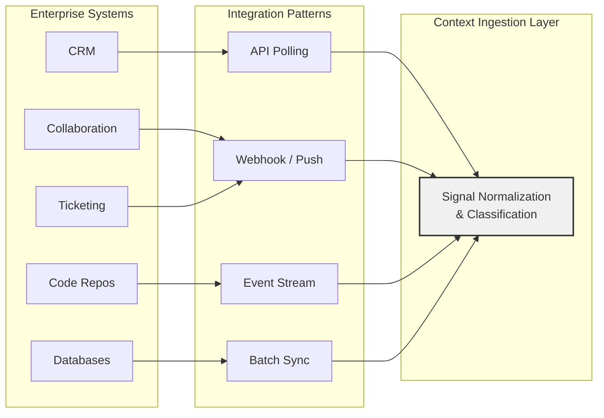

# Context Integration Patterns

*Conceptual patterns for connecting enterprise systems to context infrastructure*

Enterprise Context Fabric systems connect to many types of enterprise platforms. Each platform exposes data differently — through REST APIs, webhooks, event streams, file exports, or database interfaces. The integration pattern used to connect a source system to the context ingestion layer affects latency, freshness, reliability, and operational complexity.

This document describes conceptual integration patterns that context infrastructure may use to ingest signals from enterprise systems. It focuses on the architectural characteristics of each pattern without prescribing specific implementations.

This is a conceptual reference. Implementations may combine patterns or adapt them based on platform capabilities and organizational requirements.

---

## Integration Pattern Overview

Different enterprise systems lend themselves to different integration patterns. The pattern selected for each source system depends on the platform's capabilities, freshness requirements, and expected signal volume.

---

## Pattern 1: API Polling

The ingestion layer periodically queries source system APIs to retrieve new or updated signals.

**How it works**:
1. The ingestion layer sends authenticated API requests to the source system on a defined schedule
2. Requests typically include filters for modification timestamps or change tokens to retrieve only new or updated records
3. Returned data is normalized into the standard signal format
4. Signals are classified and staged for assembly

**Characteristics**:

| Attribute | Value |
|---|---|
| **Freshness** | Depends on polling interval (seconds to minutes) |
| **Latency** | Moderate — bounded by polling frequency |
| **Complexity** | Low — straightforward API integration |
| **Reliability** | High — retries are simple; state is managed by the polling cursor |
| **Source system load** | Moderate — regular API calls regardless of change volume |

**Best suited for**:
- Source systems that do not support webhooks or event streams
- Systems where signal freshness requirements are measured in minutes rather than seconds
- CRM platforms, project management tools, and knowledge bases with stable API surfaces

**Considerations**:
- Polling too frequently wastes resources; polling too infrequently increases staleness
- Change detection requires reliable timestamp or version tracking from the source system
- Rate limiting on source system APIs may constrain polling frequency

---

## Pattern 2: Webhook / Event Push

The source system pushes notifications to the ingestion layer when events occur.

**How it works**:
1. The ingestion layer registers webhook endpoints with the source system
2. When relevant events occur (record created, updated, deleted), the source system sends an HTTP callback to the registered endpoint
3. The ingestion layer receives the event, normalizes the payload, and classifies the signal
4. Signals are staged for assembly

**Characteristics**:

| Attribute | Value |
|---|---|
| **Freshness** | High — signals arrive within seconds of the event |
| **Latency** | Low — event-driven with minimal delay |
| **Complexity** | Moderate — requires endpoint management, retry handling, and signature verification |
| **Reliability** | Moderate — depends on source system delivery guarantees; may require idempotency handling |
| **Source system load** | Low — source system only sends when events occur |

**Best suited for**:
- Collaboration tools that emit events for messages, reactions, and channel activity
- Ticketing systems that fire events on ticket creation, assignment, and status changes
- Systems where near-real-time freshness is required

**Considerations**:
- Webhook delivery is not always guaranteed; implementations may need dead-letter queues and retry mechanisms
- Payload formats vary across platforms; normalization must handle schema differences
- Endpoint security requires signature verification to prevent unauthorized signal injection

---

## Pattern 3: Event Stream

The ingestion layer subscribes to a continuous stream of events from the source system or an intermediary event platform.

**How it works**:
1. The source system publishes events to a stream (message queue, event bus, or platform-native stream)
2. The ingestion layer subscribes to relevant topics or channels
3. Events are consumed, normalized, and classified as they arrive
4. Stream position is tracked for reliable consumption and replay

**Characteristics**:

| Attribute | Value |
|---|---|
| **Freshness** | Very high — signals arrive in near-real-time |
| **Latency** | Very low — continuous delivery without polling |
| **Complexity** | High — requires stream infrastructure, consumer management, and offset tracking |
| **Reliability** | High — streams typically provide at-least-once delivery and replay capabilities |
| **Source system load** | Low — event emission is a natural side-effect of operations |

**Best suited for**:
- High-volume systems with continuous activity (code repositories, CI/CD pipelines, monitoring systems)
- Organizations with existing event streaming infrastructure
- Use cases requiring the lowest possible Time-to-Context for ingestion

**Considerations**:
- Requires stream infrastructure (or platform-native streaming support)
- Consumer lag monitoring is necessary to detect ingestion backlog
- Schema evolution in event payloads requires versioned normalization

---

## Pattern 4: Batch Sync

The ingestion layer periodically retrieves bulk data exports from source systems.

**How it works**:
1. The source system exports data in bulk (file export, database dump, or bulk API)
2. The ingestion layer retrieves the export on a defined schedule
3. Differential processing identifies new, updated, and deleted records compared to the previous sync
4. Changed records are normalized into signals and staged for assembly

**Characteristics**:

| Attribute | Value |
|---|---|
| **Freshness** | Low — bounded by sync frequency (hours to daily) |
| **Latency** | High — full processing cycle before signals are available |
| **Complexity** | Moderate — requires differential processing and state management |
| **Reliability** | High — bulk operations are well-understood and recoverable |
| **Source system load** | Concentrated — heavy load during sync window, none between syncs |

**Best suited for**:
- Operational databases that do not expose event-driven interfaces
- Systems where data changes infrequently but comprehensively (HR systems, financial systems)
- Initial data loading and backfill scenarios

**Considerations**:
- Not suitable for use cases requiring real-time or near-real-time freshness
- Differential processing must handle large volumes efficiently
- Sync failures require full or partial re-sync capabilities

---

## Pattern Comparison

| Pattern | Freshness | Latency | Complexity | Source Load |
|---|---|---|---|---|
| **API Polling** | Minutes | Moderate | Low | Moderate |
| **Webhook / Push** | Seconds | Low | Moderate | Low |
| **Event Stream** | Sub-second | Very low | High | Low |
| **Batch Sync** | Hours | High | Moderate | Concentrated |

---

## Hybrid Integration

In practice, most Enterprise Context Fabric implementations use a combination of integration patterns. A single source system may be connected through multiple patterns:

- **Webhook + API polling**: Webhooks provide real-time signals for high-priority events, while API polling provides periodic comprehensive sync to catch any missed events
- **Event stream + batch sync**: Streaming provides real-time signals during operations, while batch sync provides periodic reconciliation and backfill
- **Tiered freshness**: Critical source systems connect through webhooks or streams for real-time freshness, while less time-sensitive systems connect through polling or batch sync

The choice of pattern for each source system should be driven by freshness requirements, available platform capabilities, and operational considerations.

---

## Relationship to Time-to-Context

Integration patterns directly affect the ingestion component of Time-to-Context. Event-driven patterns (webhooks, streams) minimize ingestion latency by delivering signals as events occur. Polling and batch patterns introduce latency proportional to their frequency.

For use cases that require the lowest Time-to-Context (incident response, real-time copilots), event-driven patterns are preferred. For use cases where freshness is measured in hours (reporting, strategic analysis), batch patterns may be sufficient and simpler to operate.

---

## Related Documents

- [Context Ingestion Layer](context-ingestion-layer.md) — Detailed ingestion layer architecture
- [Context Capsule Lifecycle](context-capsule-lifecycle.md) — Lifecycle stages starting with ingestion
- [Context Observability Reference](context-observability-reference.md) — Monitoring ingestion performance
- [Architecture Overview](architecture-overview.md) — Layered architecture overview
- [Time-to-Context Metric Framework](../specs/time-to-context-metric-framework-v0.1.md) — Measurement framework
