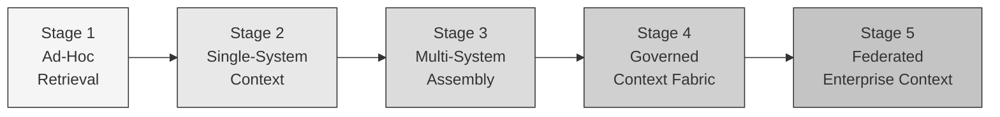

# Context Maturity Model

*A progression framework for organizational context infrastructure adoption*

Organizations adopt context infrastructure incrementally. Few start with a fully realized Enterprise Context Fabric — most begin with ad-hoc approaches to providing context to AI systems and mature through progressively more structured and governed architectures.

This document describes a conceptual maturity model for context infrastructure adoption. It defines five stages of maturity, the characteristics of each stage, and the capabilities that indicate progression from one stage to the next.

This is a conceptual reference model. Organizations may progress through stages at different rates, skip stages, or operate at different maturity levels across different parts of the organization.

---

## Maturity Stages

---

## Stage 1: Ad-Hoc Retrieval

**Description**: AI systems retrieve information from single data stores using similarity search or keyword matching. There is no dedicated context infrastructure.

**Characteristics**:
- AI applications use RAG (retrieval-augmented generation) against document stores or vector databases
- Each AI application manages its own retrieval pipeline independently
- No cross-system context assembly
- No governance layer — access controls are applied per-application
- Context is ephemeral — no persistence across sessions

**Typical setup**:
- Vector database storing document embeddings
- Per-application retrieval logic
- Manual prompt construction with retrieved documents

**Limitations at this stage**:
- Context is limited to what one data store contains
- No awareness of cross-system relationships, events, or temporal sequences
- Inconsistent context across different AI applications accessing the same information
- No audit trail for what context was delivered

**Signal to progress**: Organizations recognize that their AI systems need information from multiple enterprise systems and that per-application retrieval is creating inconsistency and governance gaps.

---

## Stage 2: Single-System Context

**Description**: AI systems receive structured context from individual enterprise systems through dedicated integrations. Context is richer than document retrieval but still siloed.

**Characteristics**:
- Direct integrations between AI applications and individual enterprise systems (CRM, ticketing, code repositories)
- Context includes entities, events, and relationships from the integrated system
- Each integration is purpose-built for a specific AI application or use case
- Some structure applied to context delivery (beyond raw document retrieval)
- No cross-system linking or assembly

**Typical setup**:
- Direct API integrations between AI applications and enterprise systems
- Application-specific context formatting logic
- Multiple independent integration pipelines for different AI use cases

**Limitations at this stage**:
- Context is siloed per-system — an AI agent helping with a customer issue sees CRM data OR ticket data, not both together
- Integration logic is duplicated across AI applications
- No shared governance or audit infrastructure
- No temporal awareness across system boundaries

**Signal to progress**: Organizations discover that AI quality improves significantly when context from multiple systems is combined, and that maintaining per-application integrations is unsustainable.

---

## Stage 3: Multi-System Assembly

**Description**: Context infrastructure assembles signals from multiple enterprise systems into unified context objects. Cross-system linking and temporal ordering emerge.

**Characteristics**:
- Shared ingestion layer connects to multiple enterprise systems
- Assembly logic combines signals across system boundaries
- Cross-system entity linking (same customer appearing in CRM, ticketing, and communication)
- Temporal ordering of events across systems
- Emergence of assembly patterns — pre-defined specifications for what context to gather
- Multiple AI applications consume from the shared assembly infrastructure

**Typical setup**:
- Centralized ingestion from multiple source systems
- Assembly engine that executes cross-system assembly patterns
- Shared context delivery interface for AI consumers
- Beginning of signal normalization and classification

**Limitations at this stage**:
- Governance may still be informal — access controls are emerging but not comprehensive
- No persistent context memory — each assembly starts fresh
- Observability is limited — no Time-to-Context measurement
- Assembly patterns may be ad-hoc rather than formally managed

**Signal to progress**: Organizations need formal governance (access controls, audit trails, compliance), persistent memory across sessions, and operational visibility into context delivery performance.

---

## Stage 4: Governed Context Fabric

**Description**: A fully governed Enterprise Context Fabric operates with formal governance, persistent memory, structured delivery, and operational observability. This represents the complete implementation of the context engineering stack within a single organization.

**Characteristics**:
- Four-layer architecture: ingestion, assembly, structuring, delivery
- Formal governance at every layer — access controls, data classification, audit logging, compliance
- Enterprise AI Memory — persistent context storage across sessions and workflows
- Context Capsule delivery — structured, self-contained packages with metadata and provenance
- Deterministic context assembly — repeatable, traceable assembly patterns
- Time-to-Context measurement and optimization
- Observability infrastructure — metrics, alerting, and operational dashboards
- Multiple consumer types supported (copilots, agents, automation, decision support)

**Typical setup**:
- Full Enterprise Context Fabric deployment
- Governed assembly patterns with formal lifecycle management
- Enterprise AI Memory for cross-session context persistence
- Observability platform tracking performance and governance metrics
- Context quality measurement across quality dimensions

**Limitations at this stage**:
- Context assembly is limited to systems within the organization's boundary
- Cross-organizational context sharing is not yet supported
- Partner and subsidiary data may not be incorporated

**Signal to progress**: Organizations need context that spans organizational boundaries — partner data, subsidiary systems, multi-division context, or cross-jurisdiction assembly.

---

## Stage 5: Federated Enterprise Context

**Description**: Context infrastructure spans organizational boundaries through federated assembly patterns. Multiple organizations or divisions share governed context while maintaining local authority.

**Characteristics**:
- Federated assembly across organizational boundaries (divisions, subsidiaries, partners)
- Formal trust relationships defining what context can be shared, with whom, and under what conditions
- Cross-boundary governance — sensitivity propagation, access control composition, audit chain continuity
- Data sovereignty compliance — respecting jurisdictional requirements for data residency and cross-border transfer
- Identity federation for entity resolution across organizational boundaries
- Multi-party context capsules with provenance from multiple contributing organizations

**Typical setup**:
- Hub-and-spoke or peer-to-peer federation infrastructure
- Trust relationship management system
- Cross-boundary governance composition engine
- Federated identity resolution for cross-organizational entity linking
- Multi-jurisdictional compliance enforcement

**Characteristics at full maturity**:
- Any authorized AI system across the federation can access relevant context from any participating organization, subject to governance
- Context assembly seamlessly spans organizational boundaries
- Trust relationships and governance policies are managed as infrastructure

See [Federated Context Assembly](federated-context-assembly.md) for detailed federation patterns.

---

## Maturity Assessment Dimensions

Organizations can assess their context infrastructure maturity across several dimensions:

| Dimension | Stage 1 | Stage 2 | Stage 3 | Stage 4 | Stage 5 |
|---|---|---|---|---|---|
| **Source systems** | Single store | Individual systems | Multiple systems | Comprehensive | Cross-organizational |
| **Assembly** | None (retrieval) | Per-system | Cross-system patterns | Deterministic, governed | Federated |
| **Governance** | None | Per-application | Emerging | Comprehensive | Cross-boundary |
| **Memory** | Ephemeral | Ephemeral | Emerging | Enterprise AI Memory | Federated memory |
| **Delivery** | Raw documents | Formatted data | Structured objects | Context Capsules | Federated capsules |
| **Observability** | None | Logging | Basic metrics | Time-to-Context, dashboards | Cross-org observability |
| **Consumers** | Single app | Few apps | Multiple apps | All consumer types | Cross-org consumers |

---

## Progression Guidance

Moving from one maturity stage to the next typically requires investment in specific capabilities:

**Stage 1 → Stage 2**: Build direct integrations with the enterprise systems most critical to AI use cases. Focus on the systems that contain the highest-value signals.

**Stage 2 → Stage 3**: Centralize ingestion and introduce cross-system assembly. Define initial assembly patterns for the highest-value use cases. Begin normalizing signals into a shared format.

**Stage 3 → Stage 4**: Formalize governance across all layers. Implement Enterprise AI Memory for persistence. Adopt Context Capsule delivery. Deploy observability and Time-to-Context measurement.

**Stage 4 → Stage 5**: Establish trust relationships with organizational partners. Implement federated assembly patterns. Deploy cross-boundary governance composition. Address data sovereignty and compliance requirements.

Not every organization needs to reach Stage 5. The appropriate maturity level depends on organizational structure, AI ambitions, and the scope of cross-boundary context requirements.

---

## Related Documents

- [Canonical Architecture](context-engineering-canonical-architecture.md) — Six-layer canonical architecture (Stage 4 reference)
- [Federated Context Assembly](federated-context-assembly.md) — Federation patterns (Stage 5 reference)
- [Context Governance Model](context-governance-model.md) — Governance checkpoints (Stage 4 reference)
- [Context Observability Reference](context-observability-reference.md) — Observability infrastructure (Stage 4 reference)
- [Context Engineering Stack](context-engineering-stack.md) — Comparison with adjacent technologies
- [Context Engineering Principles](../principles/context-engineering-principles.md) — Design principles informing maturity progression
