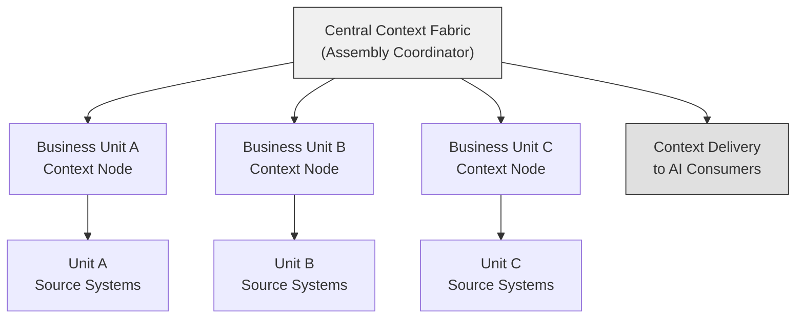

# Federated Context Assembly

*Context assembly across organizational boundaries*

Enterprise environments are not monolithic. Organizations operate across divisions, subsidiaries, partner networks, and regulatory jurisdictions. Context relevant to a task may reside in systems controlled by different organizational units, each with their own governance policies, access controls, and data sovereignty requirements.

Federated context assembly describes architectural patterns for assembling context across organizational boundaries while respecting the autonomy and governance requirements of each participating entity.

This is a conceptual reference model. Implementations may adapt federated patterns based on organizational structure, regulatory environment, and trust relationships.

---

## Why Federated Assembly Matters

As AI systems are deployed across enterprise boundaries, they increasingly need context that spans:

- **Business units** — A customer context capsule may require data from sales (CRM), engineering (ticketing), and finance (billing), each managed by separate teams with different data policies
- **Subsidiaries** — A holding company's AI systems may need context from subsidiary operations that maintain their own IT infrastructure
- **Partners and vendors** — Supply chain, channel, or integration partner data may be relevant to AI-assisted decisions
- **Regulatory jurisdictions** — Data from EU operations may be subject to GDPR, while US operations follow different frameworks, affecting how context can be assembled and delivered

Without federated patterns, organizations face a choice between siloed context (incomplete) or centralized context (potentially violating governance boundaries).

---

## Federated Assembly Principles

Federated context assembly extends the core context engineering principles with additional considerations:

- **Local authority** — Each organizational unit retains authority over its own context. No external entity can compel context sharing without explicit agreement.
- **Explicit trust relationships** — Federated assembly requires pre-defined trust relationships between participating entities, specifying what context can be shared, with whom, and under what conditions.
- **Governance preservation** — Each contributing entity's governance rules are preserved through the assembly process. The assembled context inherits the most restrictive governance of any contributing source.
- **Minimal disclosure** — Only the context necessary for the specified task crosses organizational boundaries. Full datasets are not shared; relevant signals are extracted and delivered.
- **Provenance across boundaries** — The origin and organizational ownership of every signal in federated context must be traceable.

---

## Federated Architecture Patterns

### Pattern 1: Hub-and-Spoke Federation

A central context fabric coordinates assembly across organizational units. Each unit operates its own ingestion and local assembly capabilities, exposing governed context through standardized interfaces.

**How it works**:
1. AI consumer requests context from the central fabric
2. Central fabric identifies which organizational units hold relevant signals
3. Central fabric sends scoped context requests to each unit's context node
4. Each unit assembles local context according to its own governance rules
5. Central fabric assembles cross-unit context from the contributed components
6. Assembled context is delivered to the consumer with full provenance

**Advantages**: Centralized coordination simplifies consumer experience; clear ownership boundaries
**Considerations**: Central hub becomes a coordination point; requires trust agreements with all nodes

---

### Pattern 2: Peer-to-Peer Federation

Organizational units assemble context directly with each other through bilateral trust relationships. No central coordinator is required.

**How it works**:
1. AI consumer requests context from its local context fabric
2. Local fabric identifies that some required signals reside in a peer organization
3. Local fabric sends a scoped context request to the peer's context node
4. Peer assembles and delivers governed context according to the bilateral trust agreement
5. Local fabric combines local and peer context into a unified capsule

**Advantages**: No central point of coordination; scales with peer relationships
**Considerations**: Complex trust relationship management; more difficult to maintain consistency across many peers

---

### Pattern 3: Context Exchange

Organizations publish governed context snapshots to a shared exchange layer. Consumers retrieve pre-published context from the exchange rather than requesting it directly from source organizations.

**How it works**:
1. Each organization publishes governed context snapshots to the exchange on a defined schedule
2. Published context includes metadata, classification, and access control information
3. AI consumers query the exchange for relevant context
4. The exchange enforces access controls and delivers authorized context

**Advantages**: Decouples producers from consumers; reduces real-time cross-boundary requests
**Considerations**: Context freshness depends on publication frequency; exchange becomes a shared governance boundary

---

## Trust Relationship Model

Federated assembly requires explicit trust relationships between participating entities. A trust relationship typically defines:

| Element | Description |
|---|---|
| **Participating entities** | Which organizational units are party to the relationship |
| **Shared context types** | What types of context may be shared (entity types, signal types, time ranges) |
| **Access conditions** | Under what conditions context may be accessed (task types, consumer roles, purposes) |
| **Governance constraints** | What governance rules the receiving entity must enforce (classification, retention, masking) |
| **Freshness requirements** | How current shared context must be |
| **Audit requirements** | What audit trail the receiving entity must maintain |
| **Revocation terms** | How and when the trust relationship can be terminated |

Trust relationships should be formalized, versioned, and auditable.

---

## Cross-Boundary Governance

When context crosses organizational boundaries, governance becomes more complex. The assembled context must satisfy the governance requirements of all contributing organizations.

### Governance Composition Rules

- **Classification**: Federated context inherits the **highest** classification level of any contributing signal
- **Access controls**: The consumer must satisfy the access requirements of **all** contributing organizations
- **Masking**: Each contributing organization's masking rules are applied independently — if Organization A requires a field masked, it is masked in the federated context regardless of Organization B's rules
- **Retention**: The **shortest** retention policy among contributing organizations applies to the federated context
- **Audit**: Audit records are maintained by each contributing organization for its own signals, and by the assembling entity for the federated context

### Data Sovereignty

Federated assembly must respect data sovereignty requirements:

- **Data residency** — Signals may not be transferred across geographic boundaries without compliance verification
- **Cross-border transfer** — International data transfers may require specific legal frameworks (Standard Contractual Clauses, adequacy decisions)
- **Local processing** — Some jurisdictions require data to be processed within their boundaries, which may require distributed assembly rather than centralized aggregation

---

## Challenges and Open Questions

Federated context assembly introduces several challenges that the context engineering community continues to explore:

- **Identity federation** — How should entity identity be resolved across organizational boundaries? The same customer may appear with different identifiers in different organizations.
- **Conflict resolution** — When different organizations provide conflicting signals about the same entity, how should the assembly layer reconcile the conflict?
- **Latency impact** — Cross-boundary context requests add network latency and coordination overhead. How can federated assembly maintain acceptable Time-to-Context?
- **Schema alignment** — Different organizations may structure their context differently. What interoperability standards would enable cross-boundary assembly?
- **Trust relationship management at scale** — As the number of participating organizations grows, managing bilateral trust relationships becomes complex. What patterns simplify trust management?

---

## Related Documents

- [Context Governance Model](context-governance-model.md) — Governance checkpoints within a single organization
- [Open Architecture Spec](../specs/enterprise-context-fabric-open-architecture-spec-v0.1.md) — Interoperability and security considerations
- [Context Engineering Principles](../principles/context-engineering-principles.md) — Principles including "Trust Boundaries Must Be Explicit"
- [Architecture Overview](architecture-overview.md) — Core layered architecture
- [Context Engineering Glossary](../glossary/context-engineering-glossary.md) — Terminology reference
