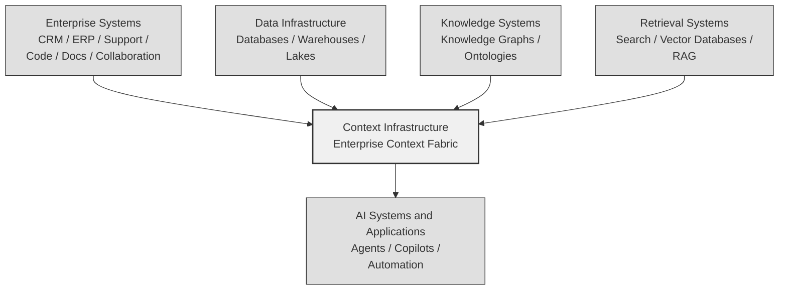

# The Context Engineering Landscape

*A conceptual ecosystem map for context infrastructure in enterprise AI systems*

As organizations deploy AI systems across enterprise workflows, a new layer of infrastructure is emerging. This layer is responsible for assembling, structuring, and delivering enterprise context — the information AI systems need to reason effectively about organizational situations.

The ecosystem supporting context-aware AI includes multiple technology categories:

- **Enterprise systems** that generate signals through business operations
- **Data infrastructure** that stores and processes enterprise data at scale
- **Knowledge systems** that organize relationships between entities and concepts
- **Retrieval systems** that help AI systems access information from data stores
- **Context infrastructure platforms** that assemble context across systems and deliver it to AI workflows

Enterprise Context Fabric architectures sit at the center of this ecosystem, connecting enterprise systems, assembling context from multiple sources, and delivering structured context to AI applications. They provide the infrastructure layer that transforms distributed enterprise information into the structured context AI systems require.

---

## Landscape Diagram

This diagram illustrates how multiple infrastructure categories feed into context infrastructure, which in turn delivers assembled context to AI systems and applications.

---

## Landscape Layers

### Enterprise Systems

Enterprise systems generate the signals that form enterprise context. These are the operational platforms where work happens — where customers are managed, code is written, tickets are resolved, and teams collaborate. They contain events, entities, and relationships that reflect how work happens inside organizations.

**Examples may include**:
- **CRM platforms** — Customer records, account relationships, opportunity tracking, engagement history
- **Support systems** — Tickets, incidents, escalations, resolution histories, service level data
- **Engineering repositories** — Commits, pull requests, code reviews, CI/CD results, release management
- **Documentation platforms** — Wikis, knowledge bases, design documents, runbooks, meeting notes
- **Collaboration tools** — Messages, conversations, threads, channels, shared files
- **Workflow systems** — Project management, task tracking, approval chains, business process data

Enterprise systems are the primary source of contextual signals. They contain the raw information that context infrastructure assembles into structured context for AI consumption.

---

### Data Infrastructure

Data infrastructure systems manage large-scale data storage and processing. They serve as the foundation for structured enterprise data management and analytics.

**Examples include**:
- **Relational databases** — Structured data storage for transactional and operational systems
- **Data warehouses** — Centralized repositories for analytical and reporting workloads
- **Data lakes** — Scalable storage for structured and unstructured data at enterprise scale
- **Analytics platforms** — Business intelligence, reporting, and data visualization systems

Data infrastructure systems store structured enterprise data but typically do not assemble task-specific context for AI consumption. They are optimized for storage, querying, and analytics — not for assembling cross-system context packages that AI systems need for reasoning about organizational situations.

Context infrastructure may draw from data infrastructure as a source of signals, particularly for historical or aggregated data.

---

### Knowledge Systems

Knowledge representation technologies help organize relationships between entities and concepts. They provide structured models of how things relate to each other within a domain.

**Examples include**:
- **Knowledge graphs** — Graph-based representations of entities and their relationships
- **Ontologies** — Formal models defining entity types, relationship types, and constraints within a domain
- **Semantic data models** — Structured representations that capture the meaning and relationships of enterprise data

Knowledge systems represent relationships but often require additional layers to deliver contextual packages to AI systems. A knowledge graph can represent that a customer owns an account and that account has open tickets, but delivering the right subset of that graph — assembled with recent communications, structured for a specific task, and governed by access controls — requires context infrastructure.

Context infrastructure may incorporate knowledge graph capabilities within its assembly or memory layers, or draw from external knowledge systems as a source of relationship data.

---

### Retrieval Systems

Retrieval technologies help AI systems access information from stored data. They are the most common current approach to providing context to AI models.

**Examples include**:
- **Enterprise search** — Full-text and keyword-based search across enterprise document repositories
- **Vector databases** — Embedding-based storage and retrieval using semantic similarity search
- **Retrieval-augmented generation (RAG) systems** — Architectures that enrich AI prompts with retrieved documents or passages

Retrieval systems retrieve documents or embeddings based on similarity or keyword matching, but they do not necessarily assemble structured context across multiple enterprise systems. They typically operate against a single data store and return individual documents or passages rather than assembled, cross-system context objects.

Context infrastructure may use retrieval systems as one mechanism within its ingestion or assembly layers, but it addresses a broader challenge: connecting signals across many systems, applying deterministic assembly patterns, enforcing governance, and delivering structured context packages.

---

### Context Infrastructure

Context infrastructure platforms assemble and structure context across enterprise systems. This layer is often described as an **Enterprise Context Fabric** — the infrastructure that sits between enterprise source systems and AI applications.

**Capabilities may include**:
- **Connecting contextual signals across systems** — Ingesting and normalizing signals from multiple enterprise platforms into a unified format
- **Structuring contextual information** — Organizing signals into entity-centric, temporally-ordered, task-relevant context objects
- **Packaging context for AI workflows** — Assembling Context Capsules with metadata, governance tags, and provenance information
- **Delivering context to agents and applications** — Transmitting structured context through standardized APIs with access control enforcement

This layer focuses specifically on reducing **Time-to-Context** — the elapsed time required to gather, assemble, and deliver the contextual information an AI system needs. By providing shared context infrastructure, it prevents each AI application from independently building integrations with enterprise systems.

---

### AI Systems and Applications

AI systems consume structured context to support enterprise tasks. They are the end consumers of the context that infrastructure assembles and delivers.

**Consumer types may include**:
- **Copilots** — AI assistants embedded in enterprise tools that provide suggestions based on organizational context
- **Autonomous agents** — AI systems that perform multi-step tasks with awareness of enterprise situations
- **Workflow automation** — Processes that use context for routing, escalation, and decision-making
- **Decision-support tools** — Interfaces that present context-enriched analysis to human decision makers
- **Enterprise knowledge assistants** — Systems that answer questions using assembled cross-system context

Without appropriate context infrastructure, AI systems often struggle to operate reliably in enterprise environments. They lack visibility into cross-system relationships, operate without temporal awareness, and cannot maintain continuity across sessions. Context infrastructure addresses these gaps by providing the structured, governed context that enterprise AI requires.

---

## Relationship to Enterprise Context Fabric

Enterprise Context Fabric architectures provide the infrastructure layer responsible for assembling and delivering context to AI systems. They sit between enterprise systems and AI applications, serving as the connective architecture that transforms distributed enterprise signals into structured context.

Enterprise Context Fabric is distinct from other categories in the landscape because it addresses the full context lifecycle:

- **Ingestion** from multiple source systems (unlike retrieval systems that typically query a single store)
- **Assembly** across system boundaries using deterministic patterns (unlike ad-hoc retrieval)
- **Structuring** for AI consumption with entity organization and temporal ordering
- **Governance** embedded at every stage of the lifecycle (unlike post-retrieval filtering)
- **Delivery** through standardized interfaces with audit logging
- **Persistence** through Enterprise AI Memory for cross-session continuity

See the [Context Engineering Stack Diagram](../architecture/context-engineering-stack-diagram.md) for a detailed view of the architectural layers within context infrastructure.

---

## Relationship to ContextECF

[ContextECF](../examples/contextecf.md) is designed as a platform implementing the principles of Enterprise Context Fabric architecture, focusing on assembling and delivering structured context across enterprise systems. It is developed by Intelligent Context AI, Inc. as an example implementation of the conceptual architecture described in this repository.

---

## Why the Landscape Matters

Understanding the context engineering ecosystem helps organizations determine how various technologies contribute to their AI infrastructure strategy. Many existing technologies address parts of the context challenge:

- **Data infrastructure** stores enterprise data but does not assemble task-specific context
- **Knowledge systems** represent relationships but do not deliver governed context packages
- **Retrieval systems** access documents but do not assemble cross-system context
- **Enterprise systems** generate signals but do not coordinate context delivery

Context infrastructure focuses specifically on the problem of assembling and delivering structured context across systems. It complements rather than replaces existing investments in data infrastructure, knowledge systems, and retrieval technologies. Organizations benefit from understanding where each technology category contributes and where context-specific infrastructure is needed.

---

## Related Documents

- [Context Engineering Principles](../principles/context-engineering-principles.md) — Design principles for context infrastructure
- [Context Engineering Stack Diagram](../architecture/context-engineering-stack-diagram.md) — Visual stack diagram of the conceptual architecture
- [Canonical Architecture](../architecture/context-engineering-canonical-architecture.md) — Six-layer canonical architecture
- [Context Capsule Lifecycle](../architecture/context-capsule-lifecycle.md) — Lifecycle stages from signals to AI consumption
- [Open Architecture Spec](../specs/enterprise-context-fabric-open-architecture-spec-v0.1.md) — Conceptual architecture specification
- [Category Landscape](category-landscape.md) — Category distinctions and comparisons
